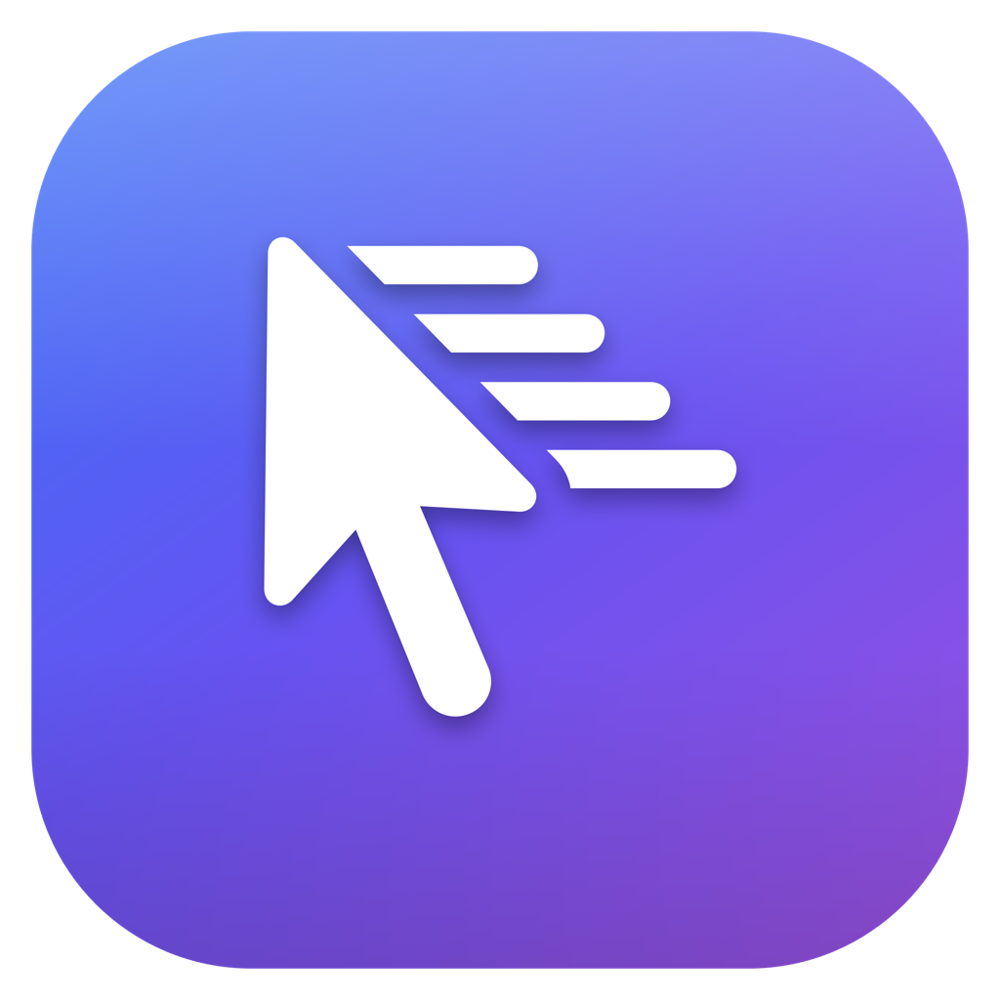
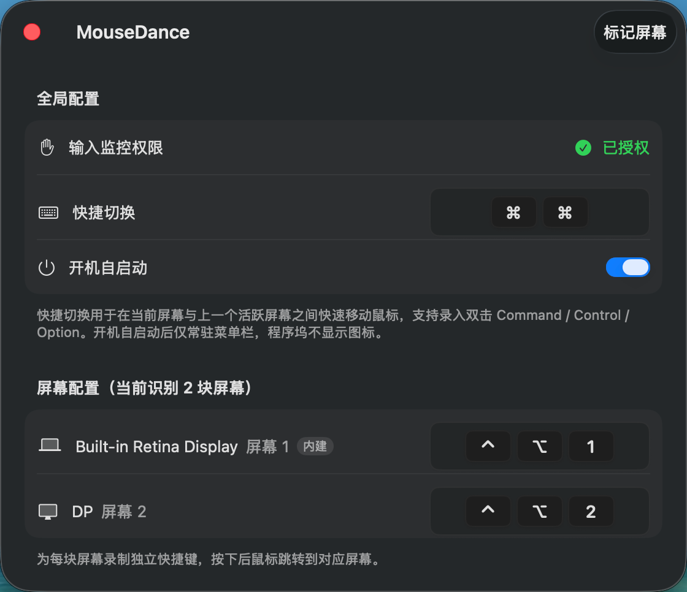

# MouseDance

<p align="center">
  
</p>

一款常驻菜单栏的 macOS 小工具：为多显示器用户的每一块屏幕配置独立快捷键，按下快捷键即可让鼠标瞬间"跳舞"到目标屏幕中央。

## 功能特性

- **多屏快捷键跳转**：为每一块屏幕单独录制快捷键，按下后鼠标立即跳转到对应屏幕
- **快捷切换**：一个全局快捷键，在当前屏幕与上一个活跃屏幕之间来回切换鼠标
- **双击修饰键支持**：支持录入双击 Command / Control / Option 这类轻量快捷键
- **屏幕标记**：一键在所有屏幕上叠加显示编号与已配置的快捷键，方便确认
- **开机自启动**：登录系统后自动常驻菜单栏运行，程序坞不显示图标
- **菜单栏快捷操作**：菜单栏图标可直接跳转到指定屏幕、查看权限与自启动状态

## 系统要求

- macOS 14 或更高版本

## 截图示例



## 下载与安装

> 本应用未使用 Apple 开发者证书签名，首次打开时 macOS 可能提示"应用已损坏，无法打开"或"无法验证开发者"。这是未签名应用的正常提示，按以下任一方式处理即可。

1. 下载并打开 `MouseDance-x.x.x.dmg`，将 `MouseDance.app` 拖入"应用程序"文件夹。

2. **解除 Gatekeeper 隔离：**

```bash
xattr -cr /Applications/MouseDance.app
```

3. 正常双击打开 MouseDance，图标将出现在屏幕右上角菜单栏。

## 首次使用

1. **授予"输入监控"权限**
   全局快捷键监听依赖该权限。首次启动后点击主窗口中的"前往授权…"，在系统设置中勾选 MouseDance；若列表中已存在，请关闭后重新打开开关。授权后快捷键才能生效。

2. **为屏幕录制快捷键**
   在主窗口"屏幕配置"区域，点击某块屏幕右侧的快捷键输入框，按下想要的组合键即完成录入；再次点击可重新录制。

3. **配置"快捷切换"（可选）**
   在"全局配置"中录制一个快捷键，用于在当前屏幕和上一个活跃屏幕之间快速往返。也可以直接双击 Command / Control / Option 进行录入。

4. **标记屏幕（可选）**
   点击窗口右上角"标记屏幕"，所有显示器上会临时叠加屏幕编号与快捷键，便于核对。

5. **开启"开机自启动"（可选）**
   开启后登录系统即自动运行，仅显示菜单栏图标。

## 卸载

退出 MouseDance（菜单栏图标 → 退出 MouseDance），然后将 `/Applications/MouseDance.app` 移入废纸篓即可。

## License

见 [LICENSE](LICENSE)。
